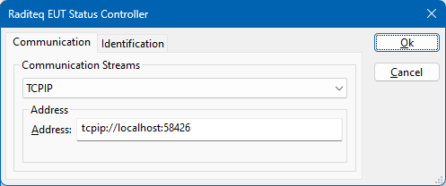
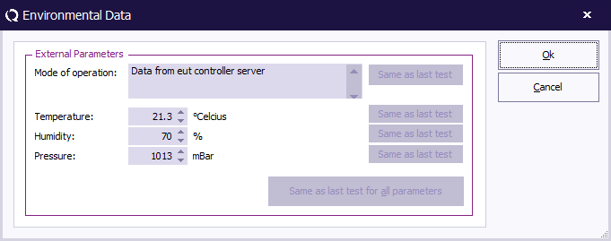

# EUT Controller TCP server
[RadiMation](https://www.raditeq.com/automated-emc-software/) is an EMC test automation software. RadiMation has the possibility to exchange test information
and status with an EUT using an EUT controller device driver. This EUT controller device driver can for example be used to inform the EUT of the actually tested frequency
and when the dwell time is started and stopped.

One of the available EUT controller device drivers is the '[Raditeq EUT Status Controller](https://wiki.radimation.com/wiki/index.php/Raditeq_EUT_Status_Controller)'. That device driver
can be configured to use any communication medium to communicate generic events to an EUT or a third party software (which can communicate it to the EUT through a proprietary protocol).

The third party software should create a TCP/IP server to listen on TCPIP port 58426. The 'Raditeq EUT Status Controller' device driver will then connect to the server, and will communicate
the actual test status. The configuration in RadiMation can be set to use 'tcpip://localhost:58426' as the address.

This Python script provides an example, on how this TCP/IP server can be implemented.
The RadiMation driver will send EUT information and Test information items to this Python EUT Controller server. Additionally it is possible to update test information items in the test data.

## Receiving EUT information items
At the start of the test the RadiMation EUT Status Controller driver will send all known EUT information items to the TCP/IP server.

The format is: EUTINFO <key>=<value>

Which key-value pairs are transmitted is completely depending on the information items that are configured on the 'EUT information' tab in the EUT window of RadiMation.

## Receiving Test information items
At the start of the test the RadiMation EUT Status Controller driver will send all known test information items to the TCP/IP server.

The format is: TESTINFO <key>=<value>

Which key-value pairs are transmitted is completely depending on the information items that are configured on the 'General Info' window in the TSF window of RadiMation.

## Update test information in the RadiMation test data
The EUT Status Controller driver will also send a request "TESTINFO?" to the server, which is then able to respond with a 'key' and 'value' which will be update or
create a new information item in the general test information of the performed test.

The format to send information back is: <key>=<value>

Every key-value pair that is provided, will be updated or added on the 'General Info' window in the test data window of RadiMation. A few specific keys with specific names
have some additional effect.
| key | additional |
| --- | ----- |
| Operating Mode | Updates the 'Mode of operation' in the 'Environmental Data' of the test  |
| Temperature    | Updates the 'Temperature' in the 'Environmental Data' of the test  |
| Humidity       | Updates the 'Humidity' in the 'Environmental Data' of the test  |
| Pressure       | Updates the 'Pressure' in the 'Environmental Data' of the test  |

In the example Python script, these keys are also transmitted by the server, which has the result in the test data in RadiMation:

# Usage
The example Python script can be used as a starting point to further automate the integration of RadiMation in automated tests. It is possible to create a specialised Python script to:
* Retrieve the temperature at a test location, to update it in the 'Environmental Data'
* Inform the end-user by some specific signal (like a SMS or Telegram message) that the test has finished
* Forward the actually tested frequency to the EUT monitoring software
* Perform an EUT validation sequence during every dwell time of a test
* Update the actual test parameters as On Screen Display (OSD) text on a monitor.
